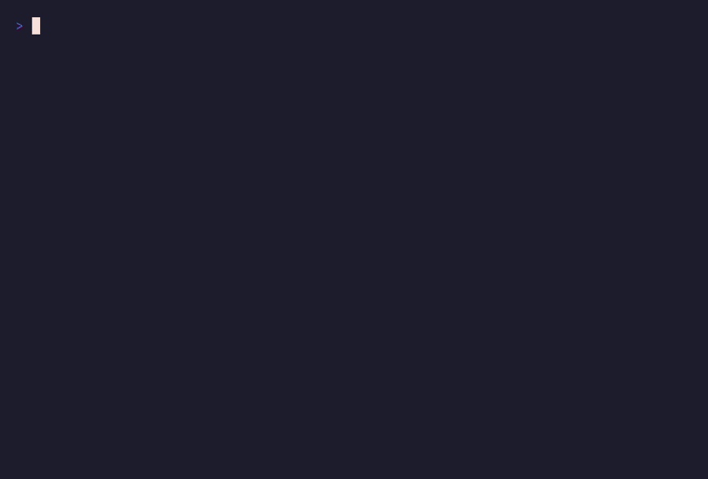

# tuichart

Render charts and diagrams as colored ANSI text in any terminal. With zero
dependencies.



```go
package main

import (
    "fmt"
    "math"

    "github.com/ChocolateNao/tuichart"
)

func main() {
    g := tuichart.New(tuichart.WithWidth(72))
    p := tuichart.NewPlot()
    p.Add(tuichart.NewLineVals("sin", func() []float64 {
        v := make([]float64, 60)

        for i := range v {
            v[i] = math.Sin(float64(i) / 9)
        }

        return v
    }()))
    g.Add(p)
    fmt.Print(g.Render())
}
```

## Documentation

The full guide lives in [`docs/`](docs/index.md):

- [Getting started](docs/quickstart.md) — install and your first chart
- [Charts: composition & layout](docs/charts.md) — `Add`/`Row`, options,
  rendering
- [Diagram reference](docs/diagrams.md) — every built-in diagram with real
  output
- [Styling & degradation](docs/styling.md) — colors, profiles, ASCII fallbacks
- [Live rendering](docs/live.md) — real-time diff-painted frames
- [Embedding in other UIs](docs/embedding.md) — bubbletea, tview, HTTP
- [Writing your own diagrams](docs/extending.md) — step-by-step custom diagram

## Features

- Line/scatter plots with braille (Unicode) or ASCII rendering
- Bar charts (grouped, stacked, horizontal), histograms
- Pie/donut charts with percentage legends
- Heatmaps with color gradients
- Function plots (`y = f(x)`) and one-line sparklines
- Multiple diagrams per chart: stacked rows or side-by-side `Row` layout
- Automatic terminal detection: truecolor / 256 / 16 colors / none, Unicode vs
  ASCII — overridable globally or per chart
- Every setting resettable back to auto behavior

## Diagrams

| Constructor                                            | Description                                                                                                                     |
| ------------------------------------------------------ | ------------------------------------------------------------------------------------------------------------------------------- |
| `NewPlot()`                                            | line & scatter plot; add series with `Add`                                                                                      |
| `NewLine(name)` / `NewLineVals(name, vals)`            | line series                                                                                                                     |
| `NewScatter(name)` / `NewScatterVals(name, vals)`      | point series                                                                                                                    |
| `NewFunction(f)`                                       | sample a function; chain `.Domain(lo, hi)`, `.Samples(n)`, `.LogY(true)`                                                        |
| `NewBar(cats, series...)` / `NewBarValues(cats, vals)` | bar chart; `.ShowValues(true)` labels each bar top                                                                              |
| `NewHistogram(data).Bins(n)`                           | histogram of raw samples                                                                                                        |
| `NewPie().Slice(name, value)`                          | pie chart; `.Donut(true)` for ring, `.ShowValues(true)` for raw values in legend                                                |
| `NewHeat(grid)`                                        | heatmap; `.Colors(low, high)`, `.RowLabels(...)`, `.ColLabels(...)`, `.CellWidth(n)`, `.ShowValues(true)`                       |
| `NewTimeline()`                                        | dated events on a time axis; `.Event(at, label)`, `.Format("2006-01-02")`, per-event `Detail` + `Side`, `.DetailColor(...)`     |
| `NewGantt()`                                           | activity bars across a time axis; `.Bar(name, start, end)`, `.Duration(name, start, d)`, `.Task(GanttBar{...})`, `.Format(...)` |
| `NewTimeSeries()`                                      | measurements over time (time X axis, value Y axis); `ts.Line(name).Add(at, v)`, `.Format(...)`, `SetXFormatter`                 |
| `NewCandlestick()`                                     | financial OHLC candles: `.Candle(at, open, high, low, close)`, `.UpColor(c)` / `.DownColor(c)`, `.Format(...)`                  |
| `NewGauge(value, max)`                                 | progress bar; `.Style(GaugeBlocks/GaugeASCII/GaugeBrackets/GaugeArrow/GaugeSegments)`                                           |
| `NewSpark(vals...)`                                    | sparkline row; also `tuichart.Spark(vals) string`                                                                               |
| `NewLive(chart, opts...)`                              | real-time repaint loop; see below                                                                                               |
| `NewRing(capacity)`                                    | thread-safe rolling sample buffer for live feeds                                                                                |

Timeline time formats: pass any Go layout to `.Format(...)` (e.g.
`time.RFC3339`, `"15:04"`, `"Jan 2"`), override ticks entirely with
`SetXFormatter`, or leave unset for automatic presets chosen from the covered
span (HH:MM:SS / HH:MM / "Jan 02 15:04" / "2006-01-02").

Timeline events take optional extras via the `TimelineEvent` struct:

```go
tl.Events(
    tuichart.TimelineEvent{At: t1, Label: "deploy", Detail: "v2.4.1"}, // detail line under the label
    tuichart.TimelineEvent{At: t2, Label: "canary", Side: tuichart.SideAbove}, // pin above the line
    tuichart.TimelineEvent{At: t3, Label: "spike", Detail: "cpu 98%", Side: tuichart.SideBelow},
)
```

`Detail` renders one row further from the axis than the label, in the chart's
detail color (`tuichart.Gray`-like dim gray by default, override with
`.DetailColor(...)`). `SideAuto` (default) alternates labels above/below;
`SideAbove`/`SideBelow` pin individual events.

Gantt and TimeSeries share the timeline's time-axis formatting rules:
`.Format(layout)` or a full `SetXFormatter` override, automatic presets when
unset. A Gantt bar is drawn from its start to its end date on its own row; a
TimeSeries connects `(timestamp, value)` points chronologically — use it for
peaks-and-troughs reporting over time.

Candlestick charts show one OHLC observation per candle: a body spanning
open..close (up-color when close >= open, down-color otherwise) plus thin wicks
reaching the period high and low; a perfect doji collapses to a dash. Defaults
are green/red; recolor freely:

```go
cs := tuichart.NewCandlestick().Title("ACME — daily").Format("Jan 02").
    UpColor(tuichart.Cyan).DownColor(tuichart.Yellow)
cs.Candle(t, 142.10, 145.80, 141.55, 144.90)
```

On colorless terminals direction survives via glyphs (`#` up, `%` down).

## Board composition

```go
g := tuichart.New(tuichart.WithWidth(80))
g.Add(plot)                    // full-width diagram
g.Row(pie, sparkline)          // two diagrams side by side
g.Add(bars)                    // another full-width diagram
fmt.Print(g.Render())          // or g.String()
```

Width defaults to the detected terminal width; `Render(width)` overrides for one
call.

## Output to any `io.Writer`

Rendering is not tied to stdout. Every chart can stream into anything that
implements `io.Writer` — files, network connections, HTTP responses, log buffers
— with the usual width convention (detected when omitted, explicit otherwise):

```go
// any writer; errors are returned, rendering itself never fails
err := g.RenderTo(os.Stdout)       // terminal width
err := g.RenderTo(&buf, 120)       // explicit width

// file
f, _ := os.Create("report.txt")
defer f.Close()
_ = g.RenderTo(f)

// http.ResponseWriter (styled for terminals, or plain text sinks)
func chartHandler(w http.ResponseWriter, r *http.Request) {
    w.Header().Set("Content-Type", "text/plain; charset=utf-8")
    _ = g.RenderTo(w, 100)
}

// reader-based APIs via io.Copy: sockets, multipart writers, ...
_, _ = io.Copy(conn, g.Reader())
```

Notes:

- `RenderTo` writes the fully rendered output in one shot and returns the first
  write error wrapped (`tuichart: rendering to writer failed: ...`); short
  writes are reported as `io.ErrShortWrite`.
- `WriteTo(w)` implements `io.WriterTo` for plumbing that uses it directly.
- Styling follows the chart's own options: build it with `WithNoColor()` or a
  fixed `WithProfile(...)` to emit clean text for non-terminal sinks.
- The live renderer already streams through `WithLiveOutput(io.Writer)` (default
  stdout), so real-time charts target buffers and connections too.
- TUI frameworks don't need any of this: use `RenderLines`, or draw cell by cell
  via `Canvas.CellAt`/`EachCell` — see [INTEGRATION.md](INTEGRATION.md).

## Styling & options

```go
g := tuichart.New(
    tuichart.WithWidth(100),      // canvas width
    tuichart.WithGap(2),          // gap between stacked diagrams
    tuichart.WithDiagramHeight(12),
    tuichart.WithPalette(tuichart.Navy, tuichart.Red, tuichart.RGB(255, 99, 71)),
    tuichart.WithUnicode(true),   // force braille/box drawing on off
    tuichart.WithProfile(tuichart.Level256), // force color depth
    tuichart.WithNoColor(),       // disable all styling (== WithProfile(tuichart.LevelNone))
)
```

Shorthand profiles: `WithColor16()`, `WithColor256()`, `WithTrueColor()`.

Global overrides (affect every chart):

```go
tuichart.SetProfile(tuichart.LevelTrue)
tuichart.SetUnicode(true)
tuichart.ResetDetection() // back to env-based detection
```

## Colors

Use named color variables instead of raw `IndexedColor()` calls. See the full
list in [Styling & degradation](docs/styling.md#named-color-variables).

```go
line := tuichart.NewLine("cpu", pts...).Color(tuichart.Cyan)
bar := tuichart.BarSeries{Name: "ok", Values: v, Color: tuichart.Lime}
heat := tuichart.NewHeat(grid).Colors(tuichart.Azure, tuichart.BrightRed)
```

For colors not in the palette, use `RGB(r, g, b)` for 24-bit truecolor or
`IndexedColor(n)` for any xterm-256 index.

## Non-Unicode terminals

Unicode support is detected from the locale, in order `LC_ALL` → `LC_CTYPE` →
`LANG`: the first variable that is set decides, and it enables unicode only if
it contains `utf-8`/`utf8`. If none of them is set at all (bare containers,
`env -i`), the library assumes a modern UTF-8 terminal. Note that `TERM=dumb`
affects color only — never unicode.

When unicode is off, every diagram degrades to plain ASCII so output stays
readable on legacy consoles and codepage-limited shells:

| Unicode                                    | ASCII fallback                  |
| ------------------------------------------ | ------------------------------- |
| braille dot-matrix curves (`⣿`)            | slope glyphs `\ / - ~`          |
| box-drawing frame `┌─┐│└┘`                 | `+ - +`                         |
| block bars `█ ▏▎▍ ...`                     | `#` with `-` partials           |
| grid dots `·`                              | `.`                             |
| sparkline ramps `▁▂▃`                      | `_ . , - = + o O #` style ramps |
| heatmap ramp `░▒▓█`                        | `. : - = * # @`                 |
| pie glyphs `● ◗ ◖ ◕`                       | distinct `* o x + #` chars      |
| gauge blocks `█`, segments `▰▱`, arrow `━` | `# -`, `[####----]`, `=`        |
| timeline markers `◆ ─ ┬`                   | `* - +`                         |
| ellipsis `…` in truncated text             | literal `...`                   |

Two things are deliberately **not** transliterated: user-provided label/title
text is rendered verbatim in both modes, and colors are an independent dimension
(see `WithNoColor`). Force either mode explicitly with `WithUnicode(bool)` /
`tuichart.SetUnicode(bool)`; the package test suite pins ASCII purity for every
diagram type, so a non-unicode terminal can never receive multi-byte structural
glyphs.

Environment handling follows the usual conventions: honors `NO_COLOR`,
`TERM=dumb`, `COLORTERM`, `WT_SESSION`, and UTF-8 locales.

## Formatters

Formatters control the **text of axis tick labels**. Every diagram accepts:

```go
p.SetXFormatter(func(v float64) string { ... })
p.SetYFormatter(func(v float64) string { ... })
p.ResetFormatters() // both back to automatic
```

The function receives the tick's _value_ (a `float64`) and must return the label
to draw. Typical uses:

```go
// milliseconds
p.SetYFormatter(func(v float64) string { return fmt.Sprintf("%.0fms", v) })

// percentages of a fixed total
p.SetYFormatter(func(v float64) string {
    return fmt.Sprintf("%.0f%%", v/total*100)
})

// human-readable byte counts
b.SetYFormatter(func(v float64) string { return units.BytesSize(v) })
```

**Default behavior when no formatter is set:** tick labels are chosen
automatically — decimals are derived from the spacing between ticks (e.g. steps
of 0.25 get 2 decimals), trailing zeros are trimmed, so you normally never need
one.

### How formatters interact with custom ticks

`SetXTicks` / `SetYTicks` (`[]Tick{{Value, Label}}`) fix tick _positions and
labels_. The rules, in order:

| You set                 | Result                                         |
| ----------------------- | ---------------------------------------------- |
| nothing                 | auto positions + auto labels                   |
| formatter only          | auto positions, your labels                    |
| ticks only              | your positions, your labels verbatim           |
| ticks **and** formatter | your positions, formatter re-labels each value |

`ResetTicks()` / `ResetFormatters()` undo the respective override.

Note: formatters affect axis labels only. Value annotations drawn next to bars,
pie slices, and the heatmap legend use the package default
(`tuichart.FormatValue`, plain numbers with scientific notation for extremes)
and are not affected by `SetXFormatter`/`SetYFormatter`.

### Timeline

A `Timeline` x-axis is time-based: the formatter receives **unix seconds** as
the `float64`. Precedence, highest first:

1. `SetXFormatter(func)` — full control:

    ```go
    tl.SetXFormatter(func(v float64) string {
        return time.Unix(int64(v), 0).Format(time.RFC3339)
    })
    ```

2. `.Format(layout)` — any Go reference-time layout:

    ```go
    tl.Format("2006-01-02 15:04")
    ```

3. unset — an automatic preset is picked from the covered span (`15:04:05` < 90
   s, `15:04` < 24 h, `Jan 02 15:04` < 30 days, else `2006-01-02`).
   `.Format("")` restores this.

### Value annotations

Numbers drawn **on** the diagram (not on axes) are toggled per diagram with
`ShowValues(true)` / `SetShowValues(bool)` / `ResetShowValues()`:

- **Bar chart** — each bar's value printed just above its top (stacked charts
  label the stack total). Horizontal bars always show values at the bar end.
- **Heatmap** — the value inside each cell, but only when it fits (`CellWidth`
  helps here).
- **Pie** — raw values in the legend next to the percentage (`home 42 (42%)`);
  terminal slices are too small for on-slice text.

All annotations use the same compact number rendering as axis defaults
(`tuichart.FormatValue`: trimmed decimals, scientific notation for extremes).

## Reset controls

Every diagram exposes setters plus matching resets:

```go
p := tuichart.NewPlot()
p.SetTitle("cpu"), p.ResetTitle()
p.SetTitleAlign(tuichart.AlignRight), p.ResetTitleAlign() // Left | Center | Right
p.SetOrientation(tuichart.OrientHorizontal), p.ResetOrientation() // swap axes;
// on bar charts this flips columns into rightward bars with category
// labels down the left edge; on plots it transposes x and y.
p.SetXLabel("t"), p.SetYLabel("load"), p.ResetLabels()
p.SetXTicks(ticks), p.SetYTicks(ticks), p.ResetTicks()       // custom Tick{Value,Label}
p.SetXFormatter(f), p.SetYFormatter(f), p.ResetFormatters()
p.SetXRange(0, 10), p.SetYRange(-1, 1), p.ResetScale()        // autoscale restored
p.SetSize(20), p.ResetSize()
p.SetGrid(false), p.SetBorder(false), p.SetLegend(false), p.SetTickCount(8)
```

Series are fluent too: `tuichart.NewLine("lat").Color(color.Red).Marker('o')`.

## Extending

Implement one interface to plug in custom diagrams:

```go
type Drawable interface {
    Draw(rc *Ctx, cv *Canvas)
    HeightHint(width int) int
    WidthHint(height int) int
}
```

`Ctx` carries resolved terminal info (`Info{Level, Unicode}`); `Canvas` provides
cell primitives — `Set(x, y, ch, style)`, `Text`, `Border`, `Sub` views, `Blit`
overlays. Compose your own axes, glyphs, or layouts and pass the result to
`Board.Add`/`Board.Row` like any built-in diagram.

## Real-time rendering

Wrap any chart in a `Live` renderer to repaint it on a fixed interval in the
terminal's alternate screen:

```go
g := tuichart.New(tuichart.WithColor256())
p := tuichart.NewPlot().Title("random walk")
line := tuichart.NewLine("value")
p.Add(line)
g.Add(p)

ring := tuichart.NewRing(60) // thread-safe rolling buffer for streaming data
lv := tuichart.NewLive(g,
    tuichart.WithInterval(100*time.Millisecond), // rerender frequency
    tuichart.OnUpdate(func() {          // runs under the render lock each tick
        ring.Push(nextSample())
        line.SetValues(ring.Values())
    }),
)
lv.Run(context.Background())         // blocks; Ctrl+C / ctx cancel exits
```

- `WithInterval(d)` sets the frame period (default 200ms, floor 10ms);
  for a target frame rate use `WithInterval(time.Second/fps)`.
- `OnUpdate(fn)` is your data pump; it is invoked before every frame while the
  render lock is held.
- `lv.Update(fn)` mutates and repaints immediately — use it for event-driven
  updates between ticks.
- `lv.Frame(w)` renders one frame as a plain string without touching the screen
  (handy for tests and custom loops).
- `lv.Stop()` ends `Run`; `lv.Done()` reports exit. Terminal state (alternate
  screen, cursor visibility) is always restored.
- Frames are painted **incrementally**: each new frame is diffed cell-by-cell
  against the last painted frame, so only the changed runs reach the terminal
  (row re-positioning + cursor-forward jumps) and an entirely unchanged frame
  writes nothing at all — small output, zero flicker. Full repaints happen only
  on the first frame or after a resize.
- Every event source — the frame ticker, terminal resizes, and update/repaint
  requests — funnels into one central channel consumed by a single loop, so
  diagram state is only ever mutated under the render lock and concurrent
  producers never race the painter.
- Stray input never leaks onto the screen: while `Run` is active echo and
  canonical mode are disabled on the terminal and typed keys, arrow/scroll
  escape sequences, and mouse bytes are swallowed (polled via `select(2)` on
  Unix, console mode on Windows). On exit the terminal is restored exactly,
  including any bytes that arrived in the final instant — nothing is replayed
  into the shell afterwards.
- Window resizes are picked up automatically without polling: SIGWINCH on Unix
  (when the output is a real TTY), console polling on Windows otherwise. A
  resize forces a full repaint at the re-detected size with the screen blanked
  first — the emulator reflows its alternate buffer on resize, so leftover cells
  are never diffed back in. Frames taller than the visible rows are clipped to
  them, so a small window scrolls nothing and the repaint never spills off the
  display.
- `tuichart.Ring` is safe for concurrent producers/consumers; pair it with
  `Line.SetValues` to swap in fresh samples each tick.

Try it: `go run ./examples/06_live`

## Embedding in TUI frameworks

Charts drop into Bubble Tea, tview, tcell, gocui, and friends with no adapter
dependencies — see [INTEGRATION.md](INTEGRATION.md) for per-framework recipes.
The building blocks:

- `Board.RenderLines(w)` — one ANSI string per terminal row
- `Canvas.CellAt` / `Canvas.EachCell` — per-cell access for custom screen
  buffers (`Cell{Ch, Fg, Bg, Bold}`)
- `Color.RGB()` — resolves any color (indexed or RGB) to concrete components for
  mapping onto framework color types

## Examples

Runnable examples live in `examples/`, ordered from simple to complex:

```sh
go run ./examples/01_sparkline   # one-line sparkline
go run ./examples/02_plot        # basic line plot
go run ./examples/03_bar         # grouped bar chart
go run ./examples/04_multi       # multiple diagrams, side-by-side gauges
go run ./examples/05_styled      # heatmap, timeline, candlestick with custom palette
go run ./examples/06_live        # real-time multi-diagram live rendering
go run ./examples/07_static      # all diagram types, static output
go run ./examples/08_custom      # a custom diagram type built from the public API
```

`09_bubbletea`, `10_tview`, `11_server`, `12_file`, and `13_gocui` demonstrate embedding
tuichart in another render loop. They are separate modules (their `go.mod` files
`replace` back to the repo root), so run them from inside their directories:

```sh
cd examples/09_bubbletea && go run .   # chart inside a bubbletea app
cd examples/10_tview && go run .       # chart cells painted onto tcell
cd examples/11_server && go run .      # chart served over plain HTTP
cd examples/12_file && go run .            # chart written to report.txt
cd examples/13_gocui && go run .           # board inside a real gocui window
```

## Development

```sh
go build ./...               # compile all
go test ./...                # unit tests
go vet ./...                 # static checks
gofmt -l .                   # formatting check
go run ./examples/07_static  # demo of every diagram type
```

Module: `github.com/ChocolateNao/tuichart`. No external dependencies.

## Benchmarks

```sh
go test -run='^$' -bench=. -benchmem -benchtime=2s
```

| Benchmark | ns/op | B/op | allocs/op |
| ----------- | ------: | -----: | ----------: |
| `BenchmarkCanvasRender` | 5,636 | 56 | 3 |
| `BenchmarkDiffPaint` | 5,551 | 88 | 4 |
| `BenchmarkBlit` | 1,424 | 0 | 0 |
| `BenchmarkBoardRender` | 4,884 | 8,576 | 11 |

Measured on:

| Spec | Value |
| ------ | ------- |
| CPU | AMD Ryzen 5 3600X (6 cores / 12 threads, x86_64, Zen 2) |
| Memory | 31 GiB DDR4 |
| OS | Manjaro Linux, kernel 6.18.50 |
| Go | go1.27.0 linux/amd64 |

- `Canvas` benchmarks render a 80×24 canvas;
- `Blit` copies a 40×12 sub-canvas;
- `BoardRender`
renders a board holding one sparkline.

Figures are indicative only — absolute numbers
shift with hardware, Go version, and terminal size, but the allocation counts show where
the hot path spends its work.

## License

[MIT](./LICENSE)
